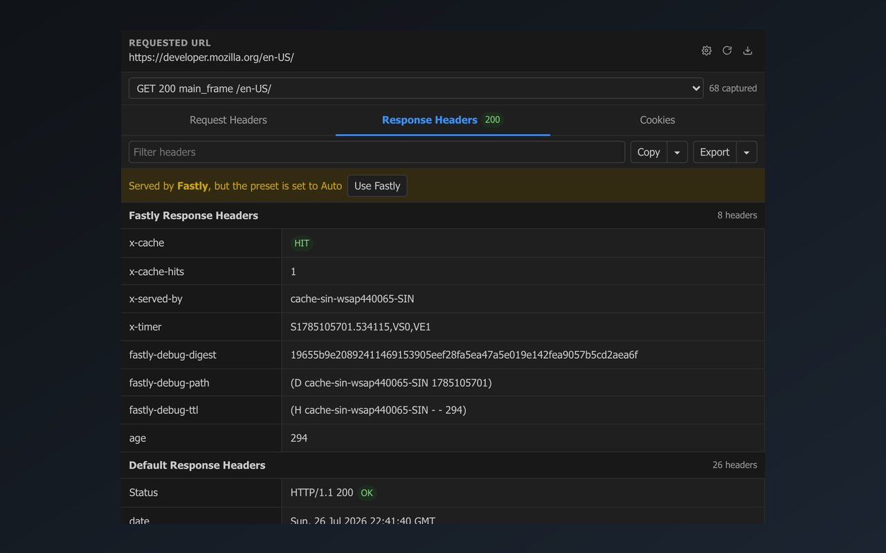
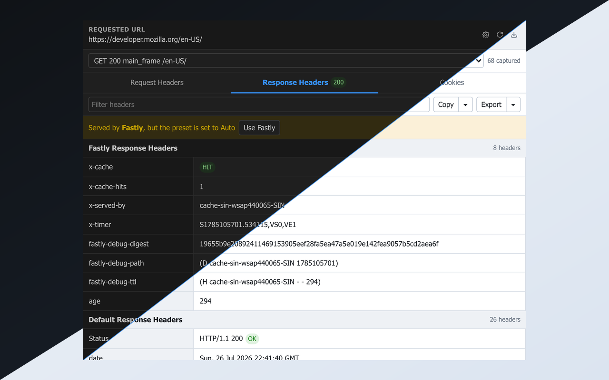
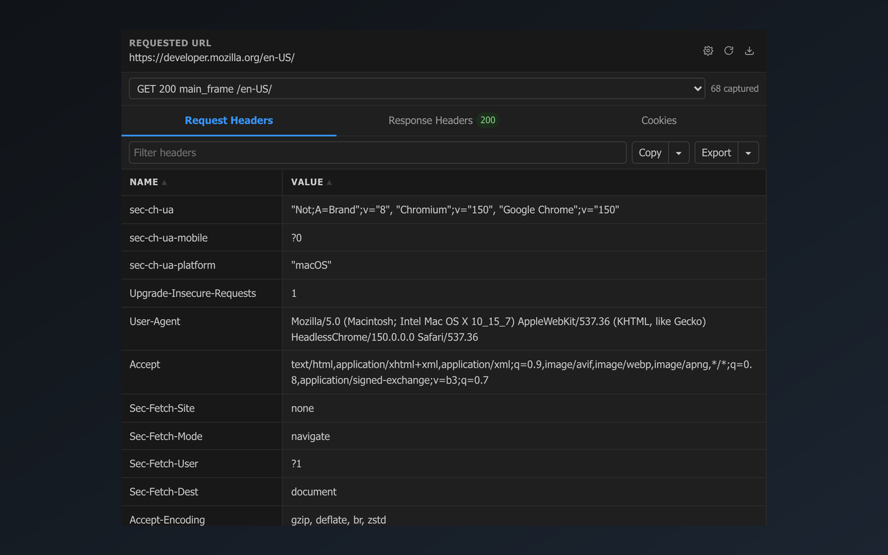
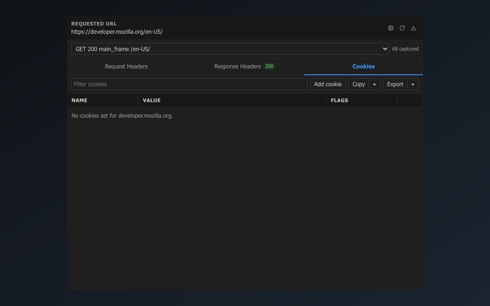
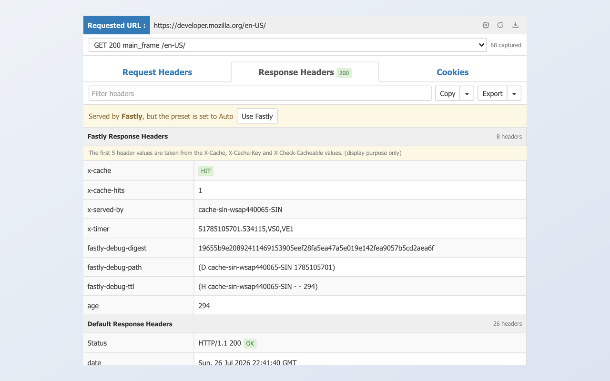
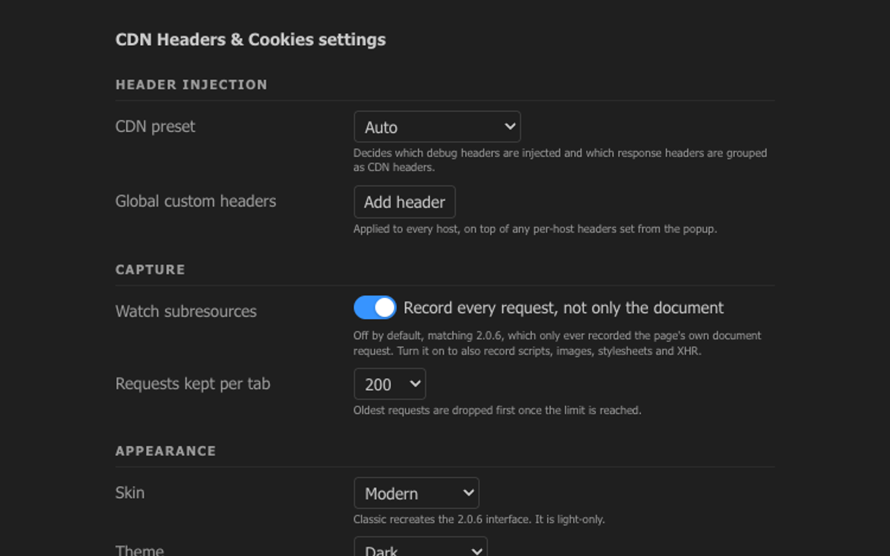

<div align="center">


# CDN Headers &amp; Cookies

**See what the edge actually did — request headers, response headers, CDN cache
state and cookies, for every request on the page.**

[](https://developer.chrome.com/docs/extensions/develop/migrate)
[](https://developer.chrome.com/docs/extensions)
[](https://extensionworkshop.com/)
[](https://react.dev)
[](https://www.typescriptlang.org)
[](https://tailwindcss.com)
[](test)
[](#licence)

</div>

---

A Manifest V3 rewrite of
[CDN Headers &amp; Cookies 2.0.6](https://chrome.google.com/webstore/detail/cdn-headers-cookies/obldlamadkihjlkdjblncejeblbogmnb),
whose last release was in 2019. No public source existed for the original, so
this is a reimplementation rather than a fork. The design is written up in
[docs/superpowers/specs](docs/superpowers/specs/2026-07-27-cdn-headers-cookies-mv3-design.md).

## What it does

<div align="center">
  
</div>

- **Names the CDN that answered.** Akamai, Cloudflare, Fastly, CloudFront, Azure
  Front Door, Google Cloud CDN, BunnyCDN, Netlify and Varnish are recognised from
  their own headers, and their debug headers are grouped ahead of the rest. Cache
  state is colour-coded, so a hit, a revalidation and a miss are one glance apart.
- **Asks the edge for more.** Once a host's CDN is known, its debug directives
  are injected on the next request, so headers like `X-Cache-Key` and
  `X-Check-Cacheable` appear where the CDN supports them.
- **Follows redirects.** The whole chain is recorded and each hop is selectable,
  because the headers that *caused* a redirect are usually the interesting ones.
  The toolbar icon carries the status code, or `× N` once the request redirected.
- **Custom request headers,** per host or globally, marked in the table so they
  read apart from the browser's own.
- **Full cookie editing** for the current domain, with the flags.
- **Copy and export** as JSON, CSV, plain text or a curl command.
- **Two skins:** a modern interface with light and dark modes, and a recreation
  of the original 2.0.6 interface.

### Light and dark

<div align="center">
  
</div>

### Request headers, with injected ones marked

<div align="center">
  
</div>

### Cookies

<div align="center">
  
</div>

### The 2.0.6 interface, rebuilt

<div align="center">
  
</div>

### Settings

<div align="center">
  
</div>

## Requirements

Chrome 116+ or Firefox 128+. Firefox 128 is the floor because header injection
uses `declarativeNetRequest` `modifyHeaders` on both browsers rather than
maintaining a second code path against Firefox's blocking `webRequest`.

## Development

```bash
npm install

npm run dev:chrome      # rebuild on change into extension/chrome
npm run dev:firefox     # rebuild on change into extension/firefox

npm run build           # production build for both browsers
npm test                # unit and component tests
npm run test:e2e        # drives a real Chrome against a live CDN (needs network)
npm run lint

npm run icons           # regenerate the extension icons from assets/logo.png
npm run screenshots     # regenerate the store screenshots (needs network)
```

Load the result as an unpacked extension: `chrome://extensions` with developer
mode on, or `about:debugging` in Firefox, pointing at `extension/chrome` or
`extension/firefox`.

## Layout

```
source/
  Background/    service worker: capture, DNR rules, storage, messaging
  Popup/         popup UI and its three panels
  Options/       settings page
  components/    shared primitives, written once against the skin tokens
  lib/           pure logic: presets, header grouping, ring buffer, export
  styles/        Tailwind entry and the skin and theme token blocks
scripts/         icon generation, store screenshots, end-to-end checks
test/            unit and component tests
```

`lib/` and `Background/rules.ts` hold the logic worth testing and are free of
browser APIs by construction. Browser APIs are reached only through
`Background/store.ts` and `Background/messaging.ts`, which is where tests stub
them.

## Credits

Built from [web-extension-starter](https://github.com/abhijithvijayan/web-extension-starter)
by abhijithvijayan.

Screenshots are taken against [MDN Web Docs](https://developer.mozilla.org),
which is served by Fastly.

## Licence

MIT.
